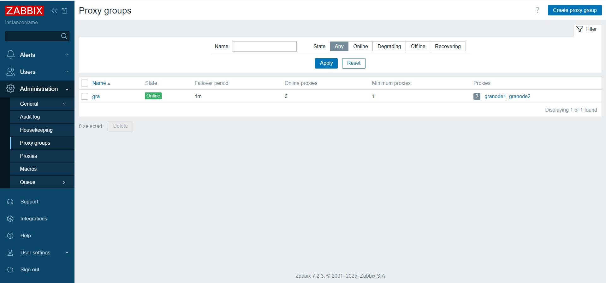

# Register Zabbix proxy via Zabbix API and assign to proxy HA group

first 3 characters of hostname will be name of proxy group

## Tested and works with

* Python 3.10
* Zabbix 7.2.3
* Ubuntu 22.04

## Download and install scripts

Install packages
```
sudo apt update
sudo apt-get -y install git python3-pip python3.10
```

Supply python dependencies
```
pip3.10 install jsonpath-ng urllib3
```

Set python scripts executable:
```
chmod +x onboardZabbixProxy.py
```

## Register new proxy

Register first proxy:
```
./onboardZabbixProxy.py \
--LocalAdress 10.10.21.21 \
--LocalPort 10051 \
--PSK abcabcabcabcabcabcabcabcabcabcab \
--PSKIdentity PSKIDENTITY \
--api_jsonrpc https://127.0.0.1:44372/api_jsonrpc.php \
--proxyName granode1 \
--token 7aad548037e06da49c5f29cfe990355b25ab0bb482565c79cbdb5ef7164fe565
```

Register second proxy:
```
./onboardZabbixProxy.py \
--LocalAdress 10.10.21.22 \
--LocalPort 10051 \
--PSK abcabcabcabcabcabcabcabcabcabcab \
--PSKIdentity PSKIDENTITY \
--api_jsonrpc https://127.0.0.1:44372/api_jsonrpc.php \
--proxyName granode2 \
--token 7aad548037e06da49c5f29cfe990355b25ab0bb482565c79cbdb5ef7164fe565
```

The name of proxy will be "granode1" and "granode2" and name of HA group will be "gra"


